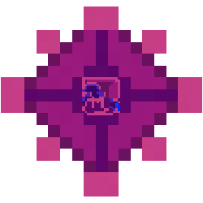

<!-- PROJECT LOGO -->
<br />
<div align="center">
  <a href="https://github.com/FunkinCompiler/funkin-extension">
    
  </a>

<h3 align="center">Funkin IDE</h3>

  <p align="center">
    An extension aiming to provide a complete environment for working on mods for Friday Night Funkin'
    <br />
    <br />
    ·
    <a href="https://github.com/FunkinCompiler/funkin-extension/issues">Report Bug or Request Feature</a>
    ·
    <a href="https://github.com/FunkinCompiler/funkin-extension/pulls">Create Pull Request</a>
  </p>
</div>


### Prevoisly known as "Funkin Compiler"
#### It's more or less implementation of [this](https://github.com/FunkinCrew/Funkin/issues/5199) suggestion.


### Funkin Compiler can work in two exviroments

- #### As an editor to new/existing V-Slice mods

  To create a new V-Slice mod, run the `Funkin compiler: Make new project` command in a empty folder.

  Opening such mod will allow you to either make quick edits more easily, or develop your existing mod (If you decide against migrating it to a project)
  As no code pre-processing is done here, some suggestions given by haxe might be wrong, so watch out!
- #### As a tool to contribute the the Friday Night Funkin "assets" repository

  If you feel like contributing your time to the development of the game, opening "assets" folder with this extension will provide you with the same tooling as if you were making a mod.

  As no code pre-processing is done here, some suggestions given by haxe might be wrong.

# Features (as of now)

### Friday Night Funkin' debugger

The `funkin-run-game` debugger is used to launch the game instance. Most notably, it supports soft-restarts (restarting will cause an in-game reload instead of re-opening the game's executable) and "Debug Console", which gives you access to the variables registered with `ModStore`.

It can also be customized with additional configuration options. We'll look at the most important ones:

- `execName`: Name of the executable to launch.
- `attachDebugger`: If enabled, adds the "debug" mod to your instance before starting it.
- `cmd_prefix`: Prefix for the launch command. The only practical use for it is launching a Windows instance of the game using "wine" on Linux.

To start, in `Run and Debug` click "create a launch.json file", from the menu select `Run the FNF: V-Slice instance`. Now you should have a basic configuration that will launch FNF version native to your platform.

Here's how you can further customize your launch configuration:

```jsonc
{
  "version": "0.2.0",
  "configurations": [
    {
      "type": "funkin-run-game", // Start FNF game
      "request": "launch",
      "name": "Compile & Run FNF mod on V-Slice engine (using wine)",
      "cmd_prefix": "wine ", // Use wine to launch the game
      "execName": "VSliceEngine.exe", // The exact executable name. (On mobile, it's the package name of the app)
      "attachDebugger": false, // Don't add the "debug" mod
      // Add these two lines if you want to test your mod on the connected Android phone
      "isMobile": true,
      "preLaunchTask": "Funk ADB: Copy this V-Slice mod to mobile",
    },
  ],
}
```

You probably noticed the mention of "connected Android phone". Here by "connected" we mean "a device available in adb".

If you want to make use of this capability, install the [Android SDK Platform Tools](https://developer.android.com/tools/releases/platform-tools) (there are a couple of tutorials on how to install them) and enable "ADB debugging" in [Developer Options](https://developer.android.com/studio/debug/dev-options#enable).

If everything works correctly, running `adb devices` should give you something like:

```sh
[mikolka@AcerGo ~]$ adb devices
List of devices attached
29291FDH300EVG  device
```

Now, to launch the debugger on your phone, add a launch configuration like this:

```jsonc
{
  "version": "0.2.0",
  "configurations": [
    {
      "name": "Launch current mod on mobile",
      "type": "funkin-run-game",
      "execName": "me.funkin.fnf",
      //Default package name. Change this if you're using a V-Slice fork with different package name.

      "isMobile": true,
      "preLaunchTask": "Funk ADB: Copy this V-Slice mod to mobile",
      "request": "launch",
    },
  ],
}
```

If you want to use an application other than "me.funkin.fnf", you'll also need to create `.vscode/tasks.json` with the following contents:

```jsonc
{
  "version": "2.0.0",
  "tasks": [
    {
      "type": "funk-mobile",
      "modName": "",
      "packageName": "me.funkin.fnf",
      //Default package name. Change this if you're using a V-Slice fork with different package name.
      "problemMatcher": [],
      "label": "Funk ADB: Copy this V-Slice mod to mobile",
    },
  ],
}
```

### Schema hints for .json files


Many `.json` files in your mod will get additional type hints, letting you check the syntax and see what you can type into them.

### Nearly all features of haxe's autocompletion server, including:
  - #### Code autocompletion
    
  - #### Code formatting
    Lets you format your haxe code using `Ctr + Alt + L` shortcut. 
  - #### Type hints
    
  - #### Static error checking
    
  - #### "Go to definition" function with Ctr+ click on function/class
    You can click with Ctr key on a field to go to it's definition.
    Works for both Haxe and FNF classes. 

  - #### Casting objects (mode 1)
    If you know the exact type of a generic variable (like the type of state from ev.targetState) you may cast it using `cast (<field>,<type>)` eg. `cast (ev.targetState,OptionsState)`.
    > **DO NOT USE** `cast <field>` (`cast ev.targetState`)

  - #### Fixing imports (mode 1)

    Attempts to fix Polymod issues with importing nested types:

    This means that:
    - *import funkin.modding.events.**ScriptEvent**.StateChangeScriptEvent;*
     
     turns into
    - *import funkin.modding.events.StateChangeScriptEvent;*

  - #### Module.scriptCall() fix (mode 1)

    Allows you to use a documented `Module.polymodExecFunc()` function instead of the missing one.
    It will be converted to the `Module.scriptCall()` once compiled.

### Blacklist detection


The extension will also warn you when importing a known blacklisted class *(Yes, ``FlxSave`` is not blacklisted anymore)*. In most scenarios, trying to import such a class will likely disable the faulty scripted class entirely. You should avoid doing that.


### Automatic .fnfc extraction (mode 1)
You can put your chars into a special ``fnfc_files`` folder and they'll be automatically included with your mod when compiled.

## How to Install

1. Install [Haxe](https://haxe.org/download/)
3. Install this extension.
4. Run `Funkin FCPKG: Setup haxelib` command to install necessary dependencies (You will be asked to select a folder to install haxelibs into).

### For mode 1 (Funkin Compiler projects)


5. Run `Funkin compiler: Make new project` to scaffold template for your mod.
6. Once done, you can customise some settings from ``funk.cfg`` file.
> Note: filepaths are based on your project's root dorectory
 - ``mod_content_folder`` Points to your mod's base folder.
 All the files here will copied first when compiling your mod.
 - ``mod_hx_folder`` Point to your code managed, and then compiled by the program.
 This is where you write your code.
 - ``mod_fnfc_folder`` Points to the FNFC files of your mod.
 Those get properly integrated into your mod when compiling.
 This lets you easily edit the songs from the game itself.

### For mode 2 (V-Slice mods)

Just launch any V-Slice mod directory. There should be a special message about activation of this mode.

**NOTE: You need to apply a patch to haxe extension first.**

Don't worry, opening any ".hxc" file will prompt you to do so.

### For mode 3 (FNF assets folder)

Same as mode 2, but instead of V-Slice mod open the "assets" folder in the FNF code repository with your IDE.

## How to migrate
#### from 0.3.0 - 0.3.2 

If you get the "Startup warning" about Funkin compiler not being configured correctly:
- Click ``Yes``
- Select folder you chose when running the `Funkin: Setup Funkin compiler` command
- Click ``Cancel`` when asked about non-clean haxelib folder.

### Additions for launch configuration

- `Funk: Compile current V-Slice mod` task (not command): Compiles the currently opened Funkin Compiler project to the FNF instance.
- `Funk: Export current V-Slice mod` task: Same as above, but doesn't copy the mod to the game.
- `Funk ADB: Copy this V-Slice mod to mobile` task: Copies your mod to the connected device. You can customise it if you want to use it with FNF Engines based on V-Slice
- `Funkin compiler: Make new project` command: As mentioned previously, creates a new Funkin Compiler project.

### Extension options

These options can be configured using the "Settings UI" under the `Extensions > Funkin Compiler` section:

- `funkinCompiler.modName`: The name of your mod in the game instance. By default, it's "workbench".
- `funkinCompiler.gamePath`: Path to the game folder. (If you remove this path, you'll be asked for it again when launching an FNF instance.)
- `funkinCompiler.haxelibPath`: Path to your haxelib folder. This should be set when running the `Funkin compiler: Setup Funkin compiler` command.

#### Working on the project
- Open the newly created project in VSCode or a fork based on it.
- Head over to the extensions tab and install all of the recommended extensions.

- Run ```Funkin compiler: Set haxelib``` to set Funkin Compiler's haxelib folder. 
- Initialise a new git repo and add at least one commit and add all files to it (I recommend to use VSCode for that)

[Here is a TTW file documenting the project's structure](./assets/scaffold/GETTING_STARED.md)

## How to compile

Mase sure to install both `vscode` and `vscode-debugadapter` haxelibs.

As for node, run `npm install vscode-debugadapter` to install dependencies for the debugger.

#### Not asossiated with "Funkin' Crew" btw.
